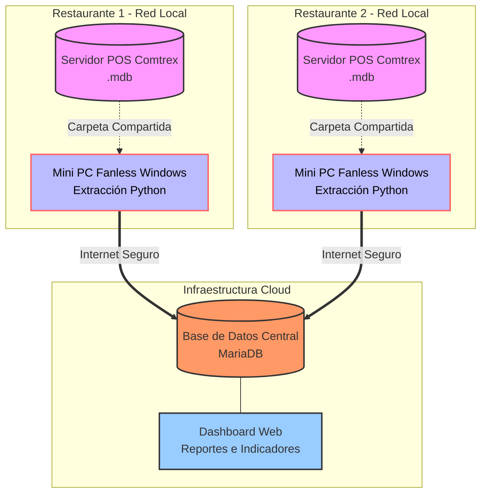

# Propuesta de Modernización y Centralización de Datos MultSucursal (Sistema POS Comtrex)

## 1. Resumen Ejecutivo
Actualmente, las distintas sucursales del restaurante operan con terminales y servidores antiguos utilizando el sistema de Punto de Venta (POS) Comtrex, cuyo almacenamiento se basa en bases de datos locales (Archivos MS Access `.mdb`). Aunque el sistema es estable para la operación diaria, carece de conectividad en la nube, lo que impide tener visibilidad en tiempo real de las ventas, descuentos, rendimiento de meseros y auditorías corporativas.

**El objetivo de este proyecto** es implementar un ecosistema de extracción pasiva (Read-Only) en tiempo real, sin instalar software de terceros en los servidores críticos del restaurante ni modificar su operación, centralizando toda la información en un servidor corporativo en la nube (MariaDB) capaz de generar reportes analíticos globales e individuales.

---

## 2. Arquitectura de la Solución Propuesta

La solución se divide en tres capas fundamentales, garantizando la **seguridad operativa** (Si la red falla, el restaurante sigue facturando normalmente sin impacto).

### Componente A: El Hardware "Puente" (Mini PC Fanless Windows)
En lugar de tocar el servidor del POS, se instalará un pequeño computador sin ventiladores (Fanless Mini PC) en la oficina térmica de cada sucursal conectado a la misma red de área local (LAN).
* **Función:** Actúa como un agente extractor pasivo. Lee el archivo `.mdb` compartido en la red usando credenciales de solo lectura.
* **Por qué Windows y no Raspberry Pi:** Los archivos de Microsoft Access tienen un emparejamiento nativo perfecto y veloz con controladores ODBC de Windows, evitando corrupciones o bloqueos del archivo de la red (lo que suele suceder al forzar la lectura desde sistemas Linux).

### Componente B: El Agente Extractor (Desarrollo a la medida)
Un script ligero codificado en Python que se ejecuta en segundo plano (cada 5, 10 o 15 minutos).
* Identifica nuevas transacciones de ventas, pagos, descuentos y desempeño de meseros.
* Empaqueta la información y la envía de forma segura a través de internet a la base de datos corporativa.

### Componente C: La Base de Datos Unificada y Dashboard (MariaDB)
Un servidor en la nube encargado de recibir y consolidar los datos de absolutamente todas las sucursales, listo para conectarse al nuevo Dashboard Financiero (Aplicación Web) que generará en segundos los reportes contables que hoy toman horas hacer a mano.

---

## 3. Desglose de Costos Estimados

### Inversión en Hardware Mínimo Viable (Pago Único por Sucursal)
| Concepto | Costo Estimado (USD) |
| :--- | :--- |
| **Mini PC Fanless intel Celeron N100 / 8GB RAM / 256GB SSD (Con Windows 11 Pro nativo)** | $120.00 - $160.00 |
| **Integración de Red (Cables, Switch si es necesario)** | $20.00 |
| **Total Hardware por Sucursal:** | **~$150.00 USD** |

### Servidor en la Nube / Hosting (Pago Mensual Recurrente)
| Concepto | Costo Estimado (USD) |
| :--- | :--- |
| **Servidor Privado (VPS) para MariaDB y Aplicación Web** (DigitalOcean, AWS, o similar) | $15.00 - $25.00 / mes |

### Costos de Desarrollo e Implementación (Nosotros 👨‍💻🤖)
*Dado que este es un desarrollo de Ingeniería a la medida.*

| Fase del Proyecto | Tiempo Estimado | Valoración / Honorarios Sugeridos |
| :--- | :--- | :--- |
| **1. Arquitectura de DB Cloud** (Diseño del esquema unificado en MariaDB optimizado para albergar N sucursales). | 1 - 2 Semanas | *A convenir por el consultor líder)* |
| **2. Desarrollo del Agente Extractor (Python Windows)** (Lógico de lectura de tablas complejas de Access como TransactionHeader, DailyCashierSales, envío por API, control de fallos/reintentos locales). | 2 - 3 Semanas | *A convenir por el consultor líder* |
| **3. Desarrollo del Panel / Reportes Web (Dashboard)** (Interfaz de reportes automatizados de cortes, meseros, formas de pago y filtrado corporativo). | 3 - 4 Semanas | *A convenir por el consultor líder* |
| **4. Despliegue, Pruebas Piloto (Primera Sucursal)** (Puesta en marcha, estabilización y validación contable contra tickets reales). | 1 Semana | *A convenir por el consultor líder* |

*(Nota: Como equipo consultor [Humano + Asistente IA], los tiempos de código se reducen drásticamente, lo que te permite ofrecer al restaurante un costo de implementación sumamente competitivo respecto a agencias corporativas tradicionales que cobrarían miles de dólares).*

---

## 4. Beneficios Finales para los Restaurantes
1. **Riesgo Operativo Cero:** Al usar una Mini PC independiente, el viejo servidor que toma los pedidos jamás se satura ni requiere instalación de "parches".
2. **Escalabilidad Inmediata:** Si abren una nueva sucursal, simplemente se conecta otra Mini PC de $150 dólares y automáticamente aparece en el panel.
3. **Visibilidad Corporativa:** Los gerentes ya no tienen que llamar o recibir excels por correo de cada sucursal al final de la noche; lo verán en tiempo real en la Web, unificado o desglosado.
4. **Rescate de Datos Muertos:** Se alarga la vida útil de los terminales "antiguos" de Comtrex dotándolos de un superpoder moderno (Cloud Access) sin pagar costos altísimos a la empresa por actualización de cajas registradoras.
